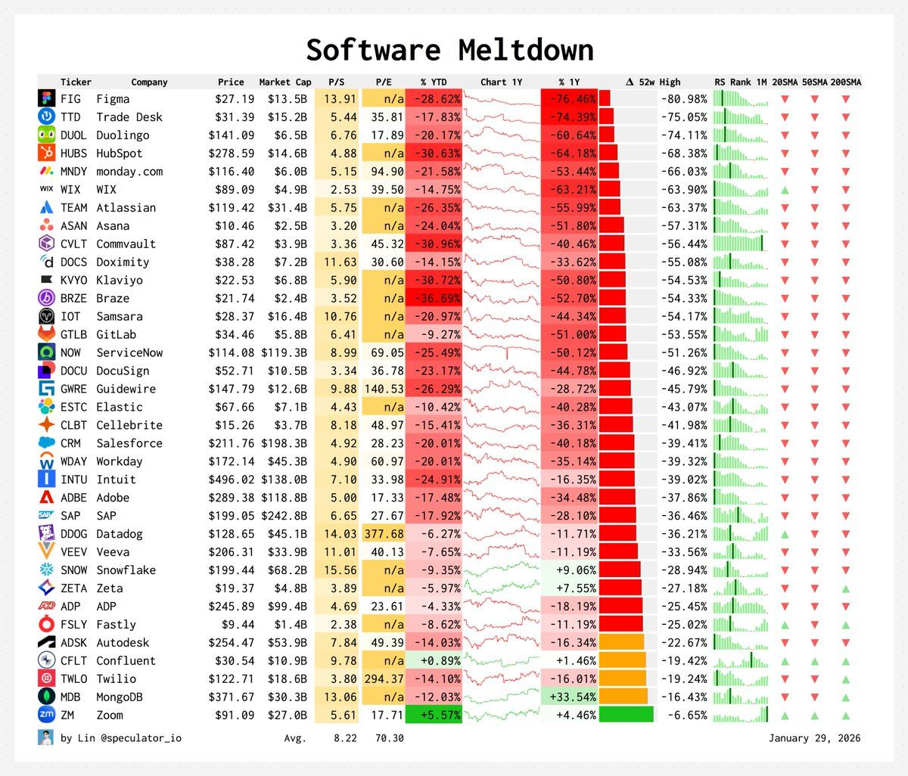

# The State of AI: A Critical View

Note:
Welcome everyone. Today I'll give a balanced view of AI - not the hype, not the fear, but what's actually happening.

---

---

### The Narrative

- AI will solve everything
- AGI is around the corner
- Human-level intelligence imminent
- We will all lose our jobs
- Singularity is near
- We should be scared... or excited?

Note:
This is the dominant narrative in tech media. Every week there's a new breakthrough. But let's look at reality.

---

---

[Link to post](https://www.linkedin.com/posts/thomas-wiesner_claude-coding-softwaredevelopment-activity-7449779801055244289-Z_ra)

---
### Industries

- Banking & Credit Scoring
- Healthcare & Diagnostics
- Legal & Courts
- Insurance Underwriting
- HR & Hiring Decisions
- Criminal Justice
- Government Benefits

---

### What's Overstated

### "AI will replace jobs"
- It amplifies human capability
- Still needs human oversight
- New jobs created, old ones transformed

### "AGI is imminent"
- No coherent definition
- No path to general intelligence
- Narrow AI = narrow results

---

## The Hidden Costs

### Compute & Energy
- Training GPT-4: ~$100M+
- Environmental impact
- Only big corps can compete

### Data
- The internet is finite
- Quality matters
- Copyright issues

Note:
The compute costs are enormous. Only 3 companies can afford to train frontier models. This is not democratized AI.

---

## The Centralization Problem

- 3 companies control the future
- Open-source is closing gaps
- Hardware moats
- Infrastructure lock-in

---

## What Works

- Code assistance (Copilot, etc.)
- Image generation (with caveats)
- Transcription
- Search augmentation

---

## What Doesn't Work

- Long-horizon planning
- Reliability & accuracy
- True reasoning
- Understanding context

---

## The Trust Problem

- Hallucinations everywhere
- No verification built-in
- Users trust too much
- "AI slop" everywhere

---

## The Business Reality

- Most AI startups lose money
- Infrastructure costs are huge
- Hard to differentiate
- Competition from big tech

---

## A Pragmatic View

- Tool, not magic
- Amplifier, not replacement
- Requires human judgment
- Still early, still limited

---

## What Matters

- Understanding limitations
- Appropriate skepticism
- Focus on real problems
- Practical applications

---

## Questions?
