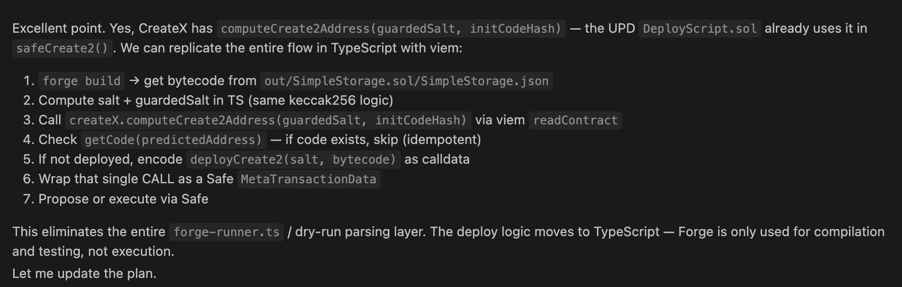
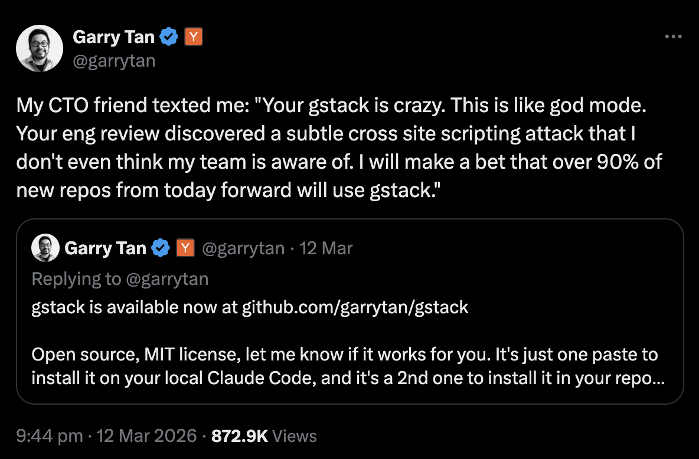

# Building AI products with AI

Note:
Welcome everyone. Today I'll give a balanced view of AI - not the hype, not the fear, but what's actually happening.

---

### The Narrative

- AI will solve everything
- AGI is around the corner
- Human-level intelligence imminent
- We will all lose our jobs
- Singularity is near
- We should be scared!

Note:
This is the dominant narrative in tech media. Every week there's a new breakthrough. But let's look at reality. Who benefits from this narrative?

AGI is imminent
- No coherent definition
- No path to general intelligence
- Narrow AI = narrow results
---

---

Note:
This is a very-well known fear cycle pattern that's been used in marketing for a very long time. You present people with an upcoming problem that may destroy their way of life and you give them the `solution`. Additionally to that current AI models are very good of hooking directly into you dopamine cycle.
Anthropic has been using this model very affectively to sell their products.

---

[Link to post](https://www.linkedin.com/posts/thomas-wiesner_claude-coding-softwaredevelopment-activity-7449779801055244289-Z_ra)

---

### God Complex (RLHF)

Note:
RLHF - Reinforcement Learning from Human Feedback
https://www.youtube.com/watch?v=Q6nem-F8AG8
---

### Allbirds

[CNBC](https://www.cnbc.com/2026/04/15/allbirds-bird-stock-shoes-ai.html)

Note:
Allbirds made a surprising announcement Wednesday that it is pivoting from shoes to artificial intelligence.
The move boosted shares of the miniscule market cap company — it was valued at about $21 million at Tuesday’s close — by 582%. The shares, which were under $3 a day ago, jumped to about $17.
---
### Trendslop (HBR)
>Researchers Asked LLMs for Strategic Advice. They Got “Trendslop” in Return.

[Link to post](https://hbr.org/2023/01/researchers-asked-llms-for-strategic-advice-they-got-trendslop-in-return)

Note:
https://www.youtube.com/watch?v=nDL3Ch7Nz8c

---
### Industries

- Banking & Credit Scoring
- Healthcare & Diagnostics
- Legal & Courts
- Insurance Underwriting
- HR & Hiring Decisions
- Criminal Justice
- Government Benefits

---

### Amplifier

---

### The Good Parts

- An amplifier (Amplifies stupidity as well)

Note:
Are we in the bubble - yes. Are the AI agents useful - for some tasks - sure.

---

### Humans
- Keep the human in the loop
- Keep the context short
- Write the critical code yourself (with the help of AI)
- Focus on the real problems

Note:
Models learn from all the shitcode we wrote. You don't find a lot of gems on the internet - just remember stack overflow. 90% of the code is garbage.

If you let your agents to write the whole code without reviewing, you will end up with a enterprise grade complexity in 2 to 3 weeks with 2 people and 10 agents.

Once the bugs will pile up and your customers will start calling - who is going to deal with the issues?

---
## The Hidden Costs

### Compute & Energy
- Training GPT-4: ~$100M+
- Environmental impact
- Only big corps can compete

### Data
- The internet is finite
- Quality matters
- Copyright issues

Note:
The compute costs are enormous. Only 3 companies can afford to train frontier models. This is not democratized AI.

---

## The Centralization Problem

- 3 companies control the future
- Open-source is closing gaps
- Hardware moats
- Infrastructure lock-in

---

## What Works

- Code assistance (Copilot, etc.)
- Image generation (with caveats)
- Transcription
- Search augmentation

---

## What Doesn't Work

- Long-horizon planning
- Reliability & accuracy
- True reasoning
- Understanding context

---

## The Trust Problem

- Hallucinations everywhere
- No verification built-in
- Users trust too much
- "AI slop" everywhere

---

## The Business Reality

- Most AI startups lose money
- Infrastructure costs are huge
- Hard to differentiate
- Competition from big tech

---

## A Pragmatic View

- Tool, not magic
- Amplifier, not replacement
- Requires human judgment
- Still early, still limited

---

## What Matters

- Understanding limitations
- Appropriate skepticism
- Focus on real problems
- Practical applications

---

## Questions?
